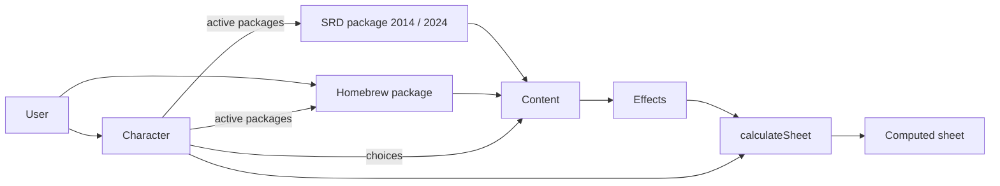

# Brief de inicio: app de hojas de personaje D&D 5e con homebrew

> **Para Claude Code:** este archivo es el punto de partida del proyecto. Léelo completo antes de hacer nada.
> Tu primera tarea está en la sección **"Primera sesión"** al final. No avances más allá de la fase 0 sin que te lo pida.

---

## 1. Sobre mí y cómo quiero trabajar

- Soy desarrollador principiante y este es un proyecto de **portafolio y aprendizaje**. Trabajo solo.
- **Explícame las decisiones** importantes en pocas palabras: qué hiciste y por qué.
- **Pasos pequeños:** una tarea a la vez. Propón un plan, espera mi visto bueno y luego implementa.
- **No agregues dependencias** que no estén en este documento sin preguntarme antes, y dime para qué sirven.
- Si algo de este documento es ambiguo o parece mala idea, **dímelo** en lugar de adivinar.
- Escribe el código, los nombres de archivos y los identificadores en **inglés**. Los comentarios de dominio y las explicaciones para mí, en **español**.
- Consulta la documentación actualizada (Context7 MCP si está disponible) antes de usar APIs de Next.js, Drizzle o Supabase. No asumas versiones viejas.

## 2. Qué es la app

Una app **web responsive** para crear y gestionar hojas de personaje de **D&D 5e**, con reglas **2014 (SRD 5.1)** y **2024 (SRD 5.2.1)**. Los usuarios pueden crear **contenido homebrew** y elegir, por personaje, qué "libros de reglas" (paquetes de contenido) están activos.

**Criterio de éxito del MVP:** un usuario crea un personaje de nivel 1 a 5 con contenido SRD 2024 y al menos un objeto o dote homebrew, y ve la hoja recalculada al instante, también en el móvil.

## 3. Alcance

| Función                                           | MVP                | Versión 1                    | Fuera de alcance |
| ------------------------------------------------- | ------------------ | ---------------------------- | ---------------- |
| Cuentas (email / Google)                          | Sí                 |                              |                  |
| Creador de personaje paso a paso                  | Niveles 1–5        | Niveles 1–20, multiclase     |                  |
| Hoja con cálculos automáticos                     | Sí                 |                              |                  |
| Seguimiento en partida                            | PG y descansos     | Espacios, condiciones, todo  |                  |
| Inventario                                        | Básico             | Peso, sintonización, monedas |                  |
| Conjuros                                          | Lista y preparados | Filtros, espacios, rituales  |                  |
| Paquete SRD 2024                                  | Sí (subconjunto)   | Completo                     |                  |
| Paquete SRD 2014                                  |                    | Sí                           |                  |
| Homebrew: objetos, dotes, conjuros                | Sí                 |                              |                  |
| Homebrew: especies, trasfondos, clases, subclases |                    | Sí                           |                  |
| Homebrew en JSON                                  | Exportar           | Importar y validar           |                  |
| Compartir hoja (solo lectura) / PDF               |                    | Sí                           |                  |
| Libros oficiales fuera del SRD                    |                    |                              | Sí (licencia)    |
| Mesa virtual, mapas, chat, campañas               |                    |                              | Sí               |
| Apps nativas                                      |                    | PWA                          | Nativas          |

## 4. Stack

| Capa                     | Tecnología                                                               |
| ------------------------ | ------------------------------------------------------------------------ |
| Lenguaje                 | TypeScript (`strict: true`)                                              |
| Framework                | Next.js (App Router) + React                                             |
| Gestor de paquetes       | pnpm                                                                     |
| UI                       | Tailwind CSS + shadcn/ui                                                 |
| Formularios y validación | React Hook Form + Zod                                                    |
| Estado del cliente       | Zustand (hoja en edición) + TanStack Query (datos del servidor)          |
| Base de datos            | Postgres en Supabase (relacional + JSONB)                                |
| ORM                      | Drizzle ORM + drizzle-kit (migraciones)                                  |
| Autenticación            | Supabase Auth                                                            |
| Tests                    | Vitest (unitarios) + Playwright (E2E, desde la fase 3)                   |
| Calidad                  | ESLint, Prettier, GitHub Actions (lint + typecheck + tests en cada push) |
| Despliegue               | Vercel + Supabase                                                        |

Usa las versiones estables más recientes de cada librería.

## 5. Arquitectura

### Estructura de carpetas (objetivo)

```
/
├─ CLAUDE.md                 # contexto permanente para Claude Code
├─ docs/
│  ├─ plan.md                # alcance, fases y decisiones (copiado de este brief)
│  └─ decisions/             # notas cortas de decisiones técnicas (ADR)
├─ src/
│  ├─ app/                   # rutas de Next.js
│  ├─ components/            # UI (shadcn/ui en components/ui)
│  ├─ rules-engine/          # LÓGICA DE REGLAS: TypeScript puro
│  │  ├─ schemas/            # esquemas Zod de Contenido, Efecto, Personaje
│  │  ├─ engine/             # calculateSheet() y helpers
│  │  └─ __tests__/
│  ├─ content/               # paquetes de contenido en JSON
│  │  ├─ srd-2024/
│  │  └─ srd-2014/           # (versión 1)
│  ├─ db/                    # esquema Drizzle, cliente, queries
│  └─ lib/                   # utilidades
└─ tests/e2e/                # Playwright
```

**Regla dura:** `src/rules-engine/` no importa React, Next.js, Drizzle ni Supabase. Son funciones puras y deterministas. Aplícalo con una regla de ESLint (`no-restricted-imports`) para esa carpeta.

### Idea central: todo el contenido es un paquete

El contenido oficial (SRD) y el homebrew usan **el mismo esquema**. Un personaje activa una lista de paquetes. El homebrew no es un caso especial.



### Entidades

| Entidad     | Campos principales                                                                                                               | Notas                                                                                                |
| ----------- | -------------------------------------------------------------------------------------------------------------------------------- | ---------------------------------------------------------------------------------------------------- |
| `Package`   | id, name, edition (`"2014"` \| `"2024"`), author, version, visibility, source (`"srd"` \| `"homebrew"`)                          |                                                                                                      |
| `Content`   | id, packageId, type (`class`, `subclass`, `species`, `background`, `feat`, `item`, `spell`…), name, description, data, effects[] | `data` y `effects` en JSONB, con un esquema Zod por `type`                                           |
| `Effect`    | target, operation, value, condition?                                                                                             | Ej.: `{ target: "ac", op: "add", value: 1 }`, `{ target: "proficiency.skill.stealth", op: "grant" }` |
| `Character` | id, userId, name, edition, activePackageIds[], baseAbilityScores, choices[], inventory[], playState                              | **Solo guarda elecciones y estado; nunca valores derivados**                                         |
| `Choice`    | level, contentId, options                                                                                                        | Ej.: habilidades elegidas de una clase                                                               |

### Motor de reglas

- `calculateSheet(character, contentIndex) => ComputedSheet` es una función pura.
- Junta los efectos del contenido elegido y los aplica en orden: **base → set → add → multiply → min/max**.
- Calcula: modificadores de atributo, bono de competencia, salvaciones, habilidades, CA, iniciativa, PG máximos, velocidad, CD y ataque de conjuros, y espacios de conjuro.
- Cada regla nueva lleva tests con personajes de ejemplo reales (por ejemplo: "Guerrero nivel 3, Des 14, cota de mallas → CA 16").
- Los rasgos que el motor no pueda modelar se permiten como **notas de texto** y **ajustes manuales** en la hoja.

## 6. Reglas legales

- Solo se incluye contenido del **SRD 5.1** y del **SRD 5.2.1**, ambos bajo **CC-BY-4.0**. Hay que poner el texto de atribución a Wizards of the Coast en una página de créditos.
- No uses la marca "Dungeons & Dragons", logos ni arte oficial. La app se describe como "compatible con 5e".
- Nunca agregues contenido de libros oficiales que no esté en el SRD.
- Para arrancar puede servir `5e-bits/5e-database` (SRD 5.1), pero revisa su licencia y adáptalo a nuestro esquema.

## 7. Hoja de ruta

Dedico unas 8–10 horas por semana.

| Fase                       | Semanas | Entregable                                                                                    | Hecho cuando…                                                                                 |
| -------------------------- | ------- | --------------------------------------------------------------------------------------------- | --------------------------------------------------------------------------------------------- |
| **0. Fundamentos**         | 1–2     | Repo, tooling, CI, despliegue "hola mundo"                                                    | `pnpm lint`, `pnpm typecheck` y `pnpm test` pasan en local y en CI; la URL de Vercel funciona |
| 1. Esquema y datos         | 3–4     | Esquemas Zod + subconjunto SRD 2024 en JSON (2 clases, 3 especies, 3 trasfondos, 20 conjuros) | Todo el JSON valida contra los esquemas en un test                                            |
| 2. Motor de reglas         | 5–6     | `calculateSheet`                                                                              | 30+ tests con personajes de ejemplo                                                           |
| 3. Personajes              | 7–8     | Auth, BD, creador paso a paso, hoja responsive                                                | Crear, guardar y reabrir un personaje en el móvil                                             |
| 4. Homebrew MVP            | 9–10    | Editor de objetos, dotes y conjuros; activar paquetes                                         | **MVP desplegado**                                                                            |
| 5. Partida                 | 11–12   | PG, descansos, espacios, condiciones, inventario                                              |                                                                                               |
| 6. SRD 2014 + más homebrew | 13–14   | Paquete SRD 5.1; homebrew de especies, trasfondos, clases y subclases; importar JSON          |                                                                                               |
| 7. Pulido                  | 15–16   | PDF, enlace de solo lectura, PWA, E2E, README con capturas                                    |                                                                                               |

No se pasa a la siguiente fase sin que la anterior esté desplegada y con los tests en verde.

## 8. Flujo de trabajo por tarea

1. **Plan:** lee el código relevante y propón un plan corto. Espera mi aprobación.
2. **Tests primero** en `rules-engine` y en la validación de esquemas.
3. **Implementa** en pasos pequeños.
4. **Verifica:** corre `pnpm lint && pnpm typecheck && pnpm test` y dime el resultado.
5. **Resume** qué cambió y qué debería revisar yo.
6. **Commit** con Conventional Commits (`feat:`, `fix:`, `test:`, `chore:`, `docs:`), uno por tarea terminada. Trabaja en ramas `feat/<nombre>` y nunca hagas push a `main` sin preguntarme.

## 9. Convenciones de código

- TypeScript estricto. Nada de `any`; si hace falta, `unknown` y valida con Zod.
- Los tipos se derivan de los esquemas Zod (`z.infer`) para no duplicarlos.
- Componentes pequeños. Server Components por defecto, y `"use client"` solo donde haga falta interactividad.
- Accesibilidad básica: labels en los formularios, contraste suficiente, navegación con teclado.
- Diseño mobile-first: la hoja debe verse bien a 390 px de ancho.
- Nada de secretos en el repo. Usa `.env.local` y deja un `.env.example` con las variables.

---

## Primera sesión (fase 0)

Objetivo: dejar el proyecto listo para empezar a construir, **sin lógica de negocio todavía**.

1. Crea `CLAUDE.md` en la raíz con un resumen **corto** (menos de 80 líneas) de las secciones 1, 4, 5 (regla dura y modelo), 6, 8 y 9 de este brief, más los comandos del proyecto.
2. Copia este brief a `docs/plan.md`.
3. Inicializa el proyecto Next.js con TypeScript, Tailwind, ESLint, App Router y `src/`, usando pnpm.
4. Configura Prettier, los scripts `lint`, `typecheck`, `test` y `format`, y Vitest con un test trivial que pase.
5. Crea la estructura de carpetas de la sección 5 con archivos `index.ts` o `.gitkeep` donde haga falta, y la regla ESLint que impide importar React o Next en `src/rules-engine/`.
6. Inicializa shadcn/ui y agrega un componente (`button`) para comprobar que funciona.
7. Crea `.env.example` (sin valores reales) y un `README.md` breve.
8. Agrega un workflow de GitHub Actions que corra lint, typecheck y tests.
9. Haz commit inicial en git.
10. Dame una lista con los **pasos manuales** que tengo que hacer yo: crear el repo en GitHub, el proyecto en Supabase y el proyecto en Vercel, y dónde pegar cada variable.

Antes de empezar, muéstrame tu plan para estos 10 pasos y espera mi aprobación.

---

## Ajustes al brief y pendientes (añadido en la fase 0)

Ajustes aplicados en la fase 0 (detalle en `docs/decisions/0001-project-location-and-tooling.md`):

- Proyecto en `C:\dev\gestor-dnd`, fuera de OneDrive.
- Scaffold antes que `CLAUDE.md` y `docs/` (create-next-app exige carpeta vacía).
- pnpm y Node fijados (`packageManager`, `.nvmrc`, `engines`).
- Dependencias extra aprobadas: `prettier-plugin-tailwindcss`, `eslint-config-prettier`.
- Librerías de fases futuras se instalan cuando se usan.

Pendientes para revisar en su fase:

- **Fase 1 — SRD 5.2.1:** `5e-bits/5e-database` es principalmente SRD 5.1; el contenido 2024 probablemente hay que transcribirlo del PDF oficial (CC-BY-4.0).
- **Fase 2 — Motor de reglas:** la CA tiene varias fórmulas base (armadura, Defensa sin armadura…) y se usa la mejor. El orden `base → set → add → multiply → min/max` necesita una etapa "elegir la base más alta".
- **Fase 3 — Drizzle + RLS:** Drizzle conecta con un rol que se salta Row Level Security; la autorización debe hacerse en el servidor o con políticas explícitas. Escribir un ADR.
- **Calendario:** 16 semanas a 8–10 h/semana es ajustado. La meta firme es el MVP (fase 4); las fases 5–7 son flexibles.
